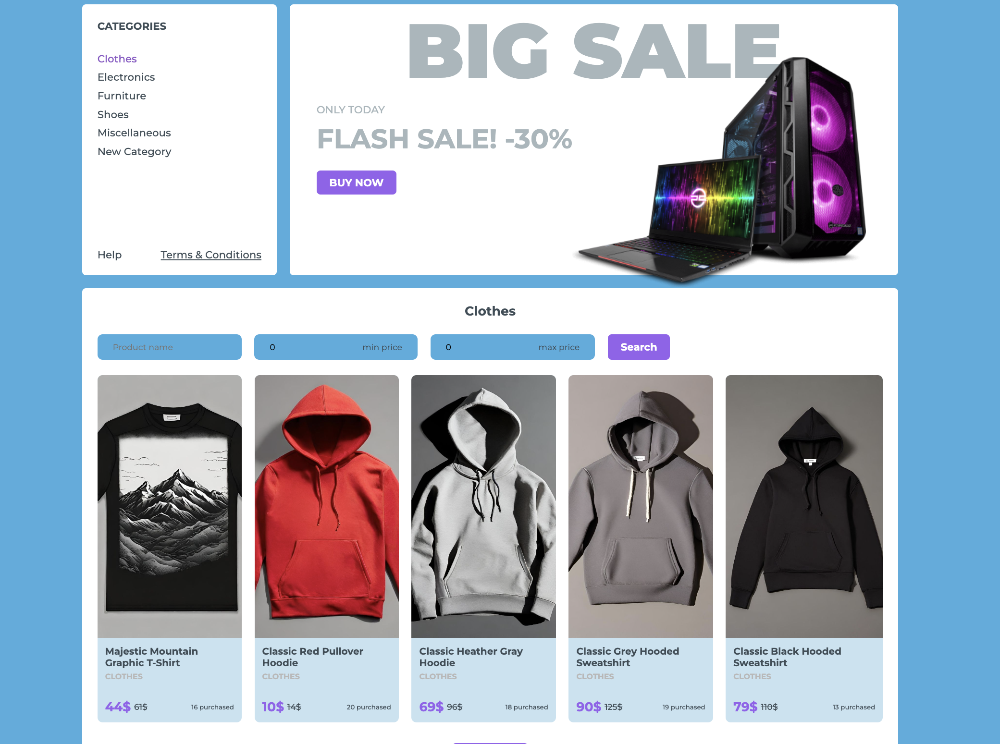

# Online shop

## Contents
1. [Main Information](#📜-Main-Information)
2. [Features](#Features)
3. [Stack](#Stack)
4. [Installation and Usage](#Installation-and-Usage)
5. [Examples](#Examples)
    1. [Homepage and Product List](#Homepage-and-Product-List)
    2. [Single item](#Single-item)
    3. [Single category with filter](#Single-category-with-filter)
    4. [Search bar](#Search-bar)
    5. [Wishlist and basket](#Wishlist-and-basket)
    6. [Recommendations](#Recommendations)
    7. [User Authentication and Profile](#User-Authentication-and-Profile)

____

## 📜 Main Information

The Online Shop is a virtual shop on the Internet where clients can 
browse and select the products conveniently from home.

Fake Store API was useful for taking the big amount of data. 
The application consists of different components, which make the usage of 
the application more convenient.

____

## Features

- **Product List:** All the clients can see a wide range of products sorted 
by categories. It makes finding a specific product more convenient. Moreover, 
they can also filter them by name, min and max price.
- **Search bar:** Can be useful if the client wants to find a specific product quickly.
- **User Authentication:** Makes it possible to sign up and login in. Later, all personal 
information can be changed in the profile.
- **Wishlist and Basket:** Clients can add there the items which they like or want to
buy.
- The components "Related products", "You might like this" and
"Less than 100$" can also encourage clients to select something.

____

## Stack

✅ HTML (JSX), CSS, SCSS

✅ JavaScript ES6+

✅ React

✅ React Router

✅ Redux

✅ Redux Toolkit

✅ Fetch API

✅ ESLint

✅ Webpack

____

## Installation and Usage

**Installation:**

* Clone the repository: git clone https://github.com/reyand8/Online-shop.git

**Usage:**

* Application
    - Navigate to the project directory: cd online-shop
    - Install dependencies: npm install
        - Run the project: npm run start
        - Open a browser and navigate to: http://localhost:3000
    - or
        - Run the project using webpack: npm run webpack-start
        - Open a browser and navigate to: http://localhost:8080
____

## Examples

### Homepage and Product List

____
____

### Single item

____
____

### Single category with filter

____
____

### Search bar

____
____

### Wishlist and basket

____
____

### Recommendations 

____
____

### User Authentication and Profile

____
____
